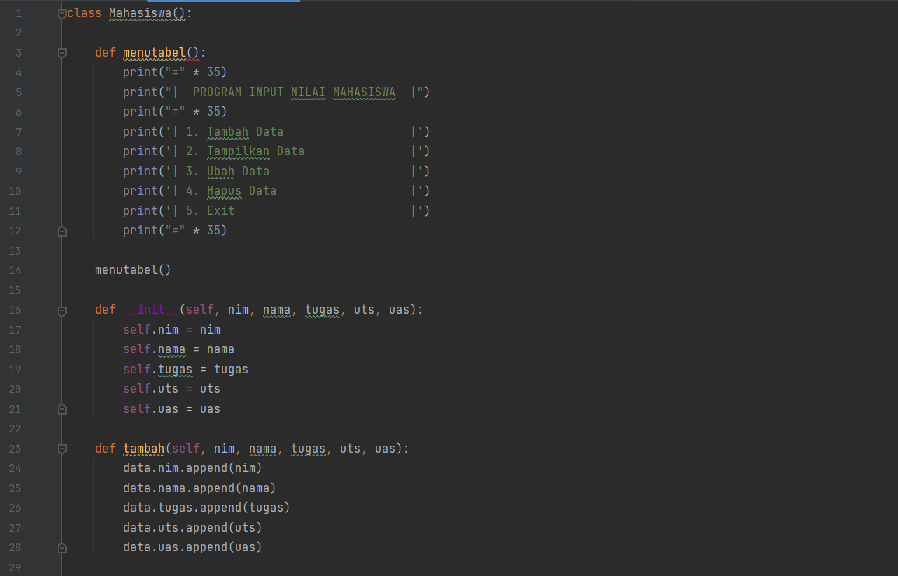
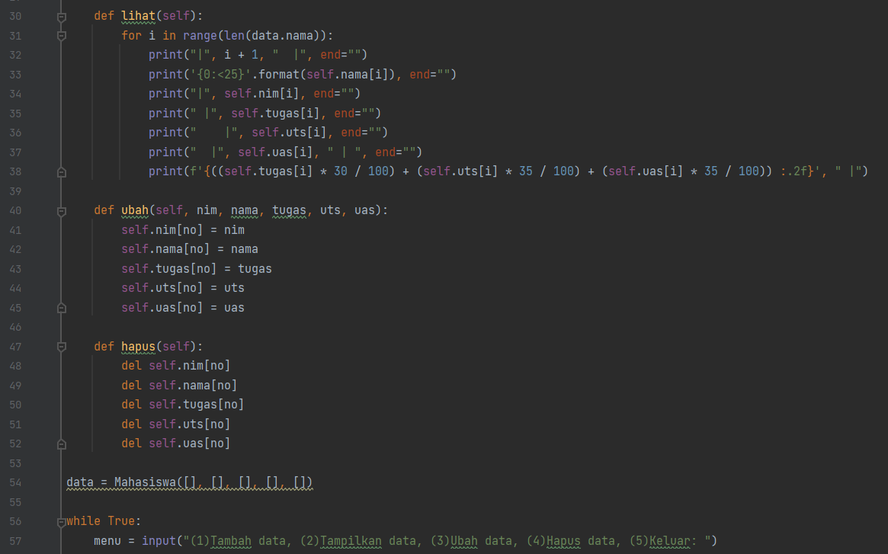
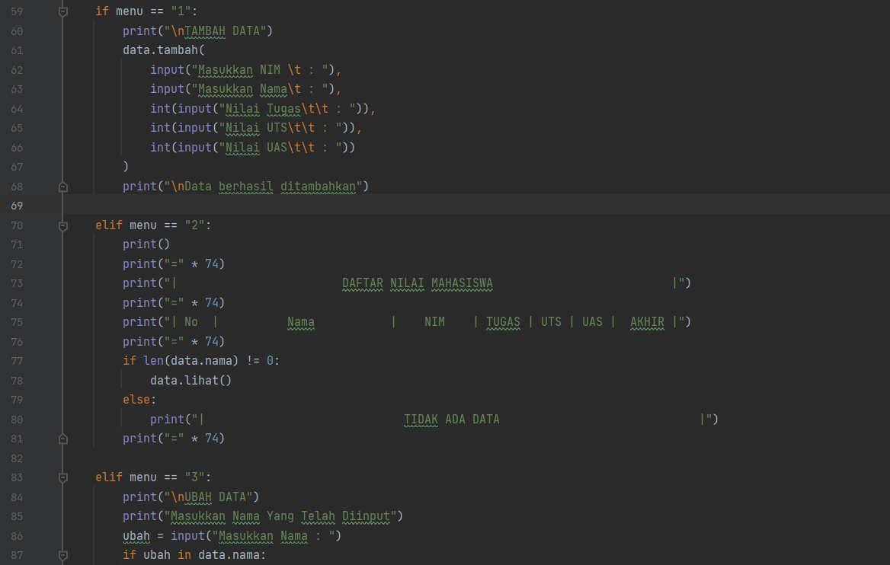
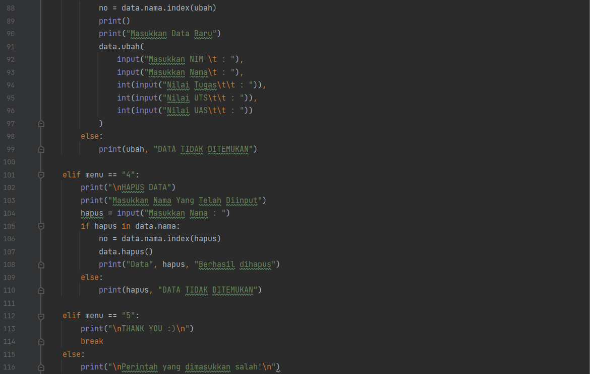
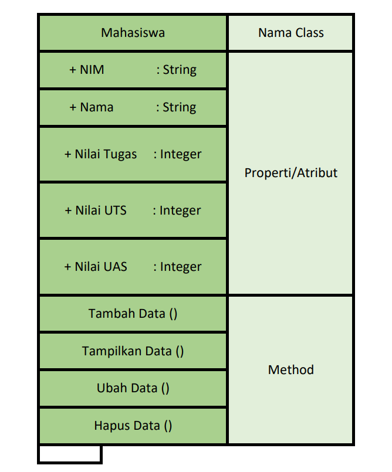
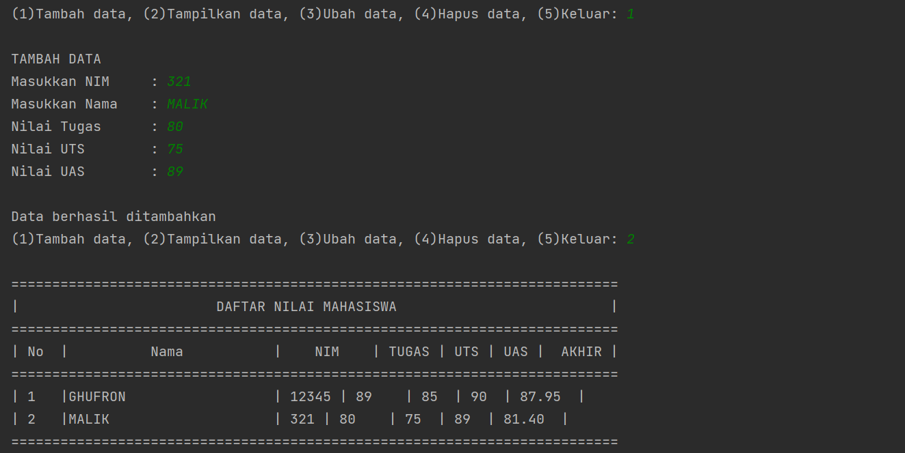
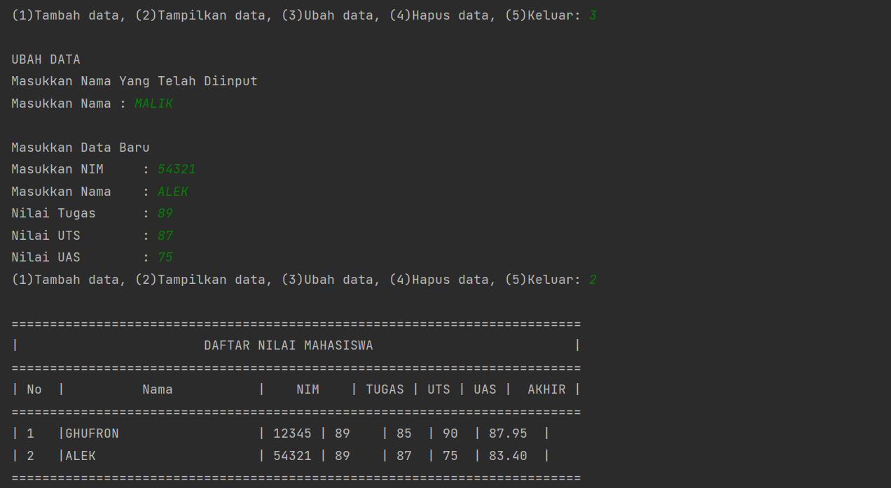
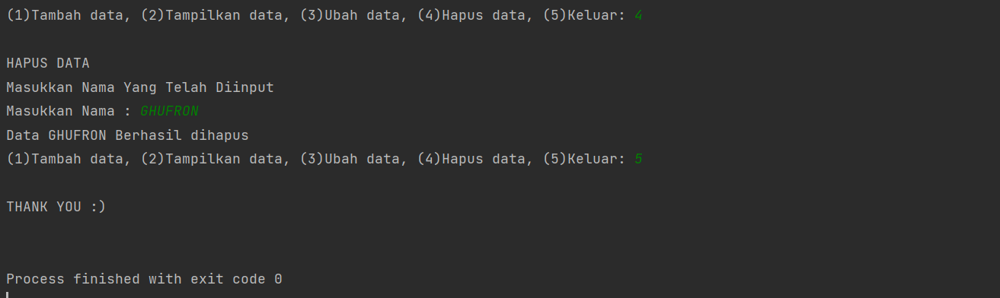

# PRAKTIKUM 8 - TUGAS PERTEMUAN 12

`Nama         :   Ghufron Malik`
`Kelas        :   TI.22.B2`
`Mata kuliah  :   Bahasa Pemrograman`

| NO |    DAFTAR ISI    |  LINK  |
|----|----------------  |--------|
|  1 |A. Latihan 1      |[Click](https://github.com/ghufronmalik64/labpy06#A-Latihan-1) |
|  2 |B. Tugas Praktikum|[Click](https://github.com/ghufronmalik64/labpy06#B-Tugas-Praktikum) |
|  3 |C. Penjelasan     |[Click](https://github.com/ghufronmalik64/labpy06#C-Penjelasan) |
|  4 |D. Hasil Output   |[Click](https://github.com/ghufronmalik64/labpy06#D-Hasil-Output) |


# A. Source Code

Program ini adalah program sederhana daftar nilai mahasiswa yang dibuat dengan mengaplikasikan penggunaan class.






# B. Flowchart

Berikut adalah Flowchart dari program data nilai mahasiswa


# C. Diagram Class

Berikut adalah Diagram Class dari program data nilai mahasiswa



## D. Penjelasan

### 1. Membuat Class
- Langkah pertama adalah membuat/mendeklarasikan sebuah `class Mahasiswa():` yang didalamnya terdapat atribut NIM, Nama, nilai tugas, nilai UTS dan nilai UAS. Untuk mendeklarasikan sebuah class didalam OOP kita harus gunakan `def__init__` dan juga `self`.
```py
    def __init__(self, nim, nama, tugas, uts, uas):
        self.nim = nim
        self.nama = nama
        self.tugas = tugas
        self.uts = uts
        self.uas = uas
```

### 2. Membuat Menu Table

- Untuk membuat table sebuah menu kita dapat menggunakan fungsi `menutabel():` yang didalamnya terdapat program sebuah menu yang dapat di input.
```py
    def menutabel():
        print("=" * 35)
        print("|  PROGRAM INPUT NILAI MAHASISWA  |")
        print("=" * 35)
        print('| 1. Tambah Data                  |')
        print('| 2. Tampilkan Data               |')
        print('| 3. Ubah Data                    |')
        print('| 4. Hapus Data                   |')
        print('| 5. Exit                         |')
        print("=" * 35)
```

### 3. Menambahkan Data
- Disini kita perlu menambahkan method seperti menambahkan, menampilkan, menghapus, dan mengubah data mahasiswa. Pada sebuah method tambah() ini berfungsi untuk menambahkan data. Dalam method ini kita menggunakan `append()` agar data yang terakhir ditambahkan ada di urutan list paling akhir.
```py
    def tambah(self, nim, nama, tugas, uts, uas):
        data.nim.append(nim)
        data.nama.append(nama)
        data.tugas.append(tugas)
        data.uts.append(uts)
        data.uas.append(uas)
```

### 4. Membuat Method Tambah
- Disini kita perlu menambahkan method seperti **menambahkan, menampilkan, menghapus,** dan **mengubah data mahasiswa**. Pada sebuah method `tambah()` ini berfungsi untuk menambahkan data. Dalam method ini kita menggunakan `append()` supaya data yang terakhir ditambahkan, ada di urutan list paling akhir
```py
    def tambah(self, nim, nama, tugas, uts, uas):
        data.nim.append(nim)
        data.nama.append(nama)
        data.tugas.append(tugas)
        data.uts.append(uts)
        data.uas.append(uas)
```

### 5. Membuat Method Lihat
- Method `lihat()` Berguna untuk menampilkan seluruh data yang telah ditambahkan. Bilamana data tersebut belum diinput/data tersebut sudah terhapus, Maka akan keluar ouput dengan tulisan "TIDAK ADA DATA". Kita menggunakan for loop untuk menampilkan banyaknya data. Nantinya data akan ditampilkan sebanyak n kali.
```py
    def lihat(self):
        for i in range(len(data.nama)):
            print("|", i + 1, "  |", end="")
            print('{0:<25}'.format(self.nama[i]), end="")
            print("|", self.nim[i], end="")
            print(" |", self.tugas[i], end="")
            print("    |", self.uts[i], end="")
            print("  |", self.uas[i], " | ", end="")
            print(f'{((self.tugas[i] * 30 / 100) + (self.uts[i] * 35 / 100) + (self.uas[i] * 35 / 100)) :.2f}', " |")
```

### 6. Membuat Method Ubah
- Method ubah() ini berfungsi sebagai menu mengubah data yang telah diinput, Inputan tersebut didalamnya terdapat atribut nama, Sedangkan untuk penginputan sebuah nim, tugas, uts, dan uas dapat kita ubah sesuai kebutuhan.
```py
    def ubah(self, nim, nama, tugas, uts, uas):
        self.nim[no] = nim
        self.nama[no] = nama
        self.tugas[no] = tugas
        self.uts[no] = uts
        self.uas[no] = uas
```

### 7. Membuat Method Hapus
- Source Code dibawah adalah untuk penghapusan sebuah data pada program yang sebelumnya telah diinput. Dan inputan dari kodingan ini berdasarkan "nama" yang sebelumnya telah diinput.
```py
    def hapus(self):
        del self.nim[no]
        del self.nama[no]
        del self.tugas[no]
        del self.uts[no]
        del self.uas[no]
```

### 8. Membuat Dictionary
- Mendeklarasikan satu dictionary kosong sebagai tempat menyimpan data-data yang sudah kita input. Disini ada 5 list kosong yang nanti isinya terdapat NIM, Nama, nilai tugas, nilai UTS dan nilai UAS.
```py
data = Mahasiswa([], [], [], [], [])
```

### 9. Menjalankan program
- Untuk menjalankan program sama seperti tugas sebelumnya,kita bisa input melalui masing-masing methods, seperti pada sebuah while loop yang didalamnya Terdapat conditional seperti source code dibawah ini.
```py
while True:
    menu = input("(1)Tambah data, (2)Tampilkan data, (3)Ubah data, (4)Hapus data, (5)Keluar: ")

    if menu == "1":
        print("\nTAMBAH DATA")
        data.tambah(
            input("Masukkan NIM \t : "),
            input("Masukkan Nama\t : "),
            int(input("Nilai Tugas\t\t : ")),
            int(input("Nilai UTS\t\t : ")),
            int(input("Nilai UAS\t\t : "))
        )
        print("\nData berhasil ditambahkan")

    elif menu == "2":
        print()
        print("=" * 74)
        print("|                        DAFTAR NILAI MAHASISWA                          |")
        print("=" * 74)
        print("| No  |          Nama           |    NIM    | TUGAS | UTS | UAS |  AKHIR |")
        print("=" * 74)
        if len(data.nama) != 0:
            data.lihat()
        else:
            print("|                             TIDAK ADA DATA                             |")
        print("=" * 74)

    elif menu == "3":
        print("\nUBAH DATA")
        print("Masukkan Nama Yang Telah Diinput")
        ubah = input("Masukkan Nama : ")
        if ubah in data.nama:
            no = data.nama.index(ubah)
            print()
            print("Masukkan Data Baru")
            data.ubah(
                input("Masukkan NIM \t : "),
                input("Masukkan Nama\t : "),
                int(input("Nilai Tugas\t\t : ")),
                int(input("Nilai UTS\t\t : ")),
                int(input("Nilai UAS\t\t : "))
            )
        else:
            print(ubah, "DATA TIDAK DITEMUKAN")

    elif menu == "4":
        print("\nHAPUS DATA")
        print("Masukkan Nama Yang Telah Diinput")
        hapus = input("Masukkan Nama : ")
        if hapus in data.nama:
            no = data.nama.index(hapus)
            data.hapus()
            print("Data", hapus, "Berhasil dihapus")
        else:
            print(hapus, "DATA TIDAK DITEMUKAN")
```

### 10. Menghentikan Program
- Jika data sudah selesai diinput, Pilih menu ke (Keluar) yaitu `"5"`, Maka program secara otomatis akan berhenti.
```py
    elif menu == "5":
        print("\nTHANK YOU :)\n")
        break
    else:
        print("\nPerintah yang dimasukkan salah!\n")
```

## Hasil OutPut
- Apabila program dijalankan maka akan menghasilkan output sebagai berikut :
- Menambahkan Data dengan input `1` dan menampilkan data dengan input `2`

- Mengubah Data dengan input `3` dan menampilkan data dengan input `2`

- Menghapus Data dengan input `4` dan keluar dari program input `5`


# Thank you may be useful